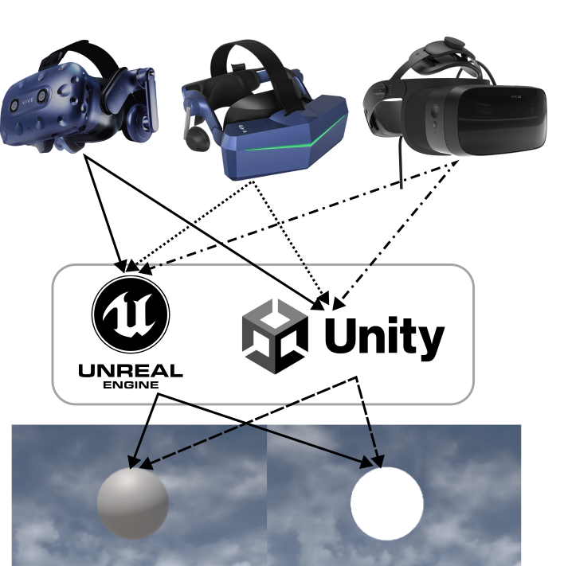

# Colorimetric Characterization

    

_The use of Virtual Reality (VR) devices has become more prevalent in both recreational and professional settings in recent years due to the increased quality and realism they offer. However, accurately representing color and luminance in VR systems requires proper color calibration that is suitable for the specific software and hardware being used. Unfortunately, there are currently no established best practices for this calibration. To address this issue, we conducted a study on the RGB intensities and reflected colors for each color channel of the HTC Vive Pro Eye VR headset. We analyzed the display spectra of this device using both Unity and Unreal 3D rendering software to measure their influence on the headset's chromatic behavior. These measurements were taken for unlit and standard shaders in both software platforms and were compared to measurements taken without rendering software to measure the display primaries' pure characteristics. Additionally, we assessed the headset's uniformity to determine the image quality over its display. Overall, we propose a methodology to carry out a color calibration customized to the type of material or graphics engine used, resulting in more accurate and realistic color representations in VR._

***
**Unity and Unreal projects**: [Link to the Wiki page VRProjects](https://github.com/rkl-gilro/ColorCharacterization/wiki/VR-Projects)

**Centering HMD using Unreal Engine**: Use this project to perform display centering before moving on to the characterization step. Verify that you can see the smallest concentric circle of the target through your measuring instrument (Konica Minolta CS-2000A spectroradiometer).

**Colorimetric Characterization using Unreal Engine:** Use this project for chromatic characterization within the Unreal engine. Verify that upon project initiation, the color chip is prominently displayed across the entirety of the screen. This can be accomplished by accessing the VR view in SteamVR. Furthermore, customization options are available, allowing you to alter the material or shader to suit your specific needs.

**Colorimetric Characterization using Unity:** Use this project for chromatic characterization within the Unity engine. Verify that upon project initiation, the color chip is prominently displayed across the entirety of the screen. This can be accomplished by accessing the VR view in SteamVR. Furthermore, customization options are available, allowing you to alter the material or shader to suit your specific needs.

***

Please refer to:

Francisco Díaz Barrancas, Raquel Gil Rodríguez, Avi Aizenman, Florian S. Bayer, Karl R. Gegenfurtner; "Color calibration in virtual reality for Unity and Unreal," 2023 IEEE Conference on Virtual Reality and 3D User Interfaces Abstracts and Workshops (VRW), Shanghai, China, 2023, pp. 733-734.
[DOI](10.1109/VRW58643.2023.00209)

Francisco Díaz Barrancas, Raquel Gil Rodríguez, Avi Aizenman, Florian S. Bayer, Karl R. Gegenfurtner; "Color Calibration in Virtual Reality Using Different Head Mounted Displays," Journal of Vision 2023;23(9):5257.
